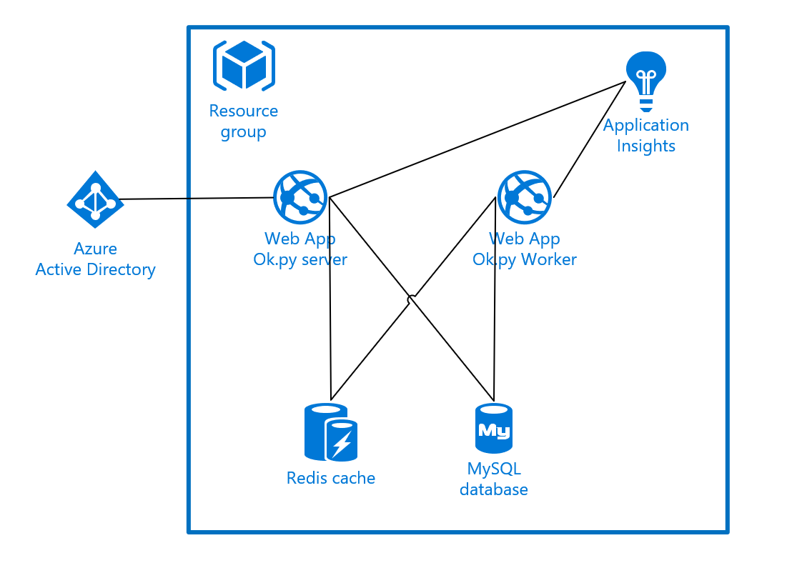

# Deploy to Azure PaaS

These templates deploy Ok.py to Azure. In a production environment you may wish to customize these templates to share resources between environments and to adjust resource sizing. For example you may wish to use a single mySQL server with multiple databases, rather than one server per environment.

## Architecture

## Accept SendGrid Terms
Prior to deploying the tempkate 
Using PowerShell:

''' Get-AzureRmMarketplaceTerms -Publisher "sendgrid" -Product "sendgrid_azure" -Name "free" | Set-AzureRmMarketplaceTerms -Accept '''

This can be run in the cloud shell.

