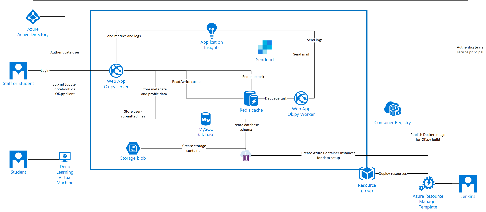

# Deploy to Azure PaaS

These templates deploy Ok.py to Azure. In a production environment you may wish to customize these templates, for
example to share resources between environments or to adjust resource sizing. For example you may wish to use a single
MySQL server with multiple databases, rather than one server per environment, or a shared SendGrid resource for email
delivery.

<a href="https://portal.azure.com/#create/Microsoft.Template/uri/https%3A%2F%2Fraw.githubusercontent.com%2Ficokpy%2Fok%2Fmaster%2Fazure%2Fpaas%2Fazure.deploy.json" target="_blank">
    
</a>

## Architecture



## Accept SendGrid Terms

Prior to deploying the template, you need to accept the SendGrid terms of service, for example using PowerShell in the
[Azure Cloud Shell](https://azure.microsoft.com/en-gb/features/cloud-shell/):

```
Get-AzureRmMarketplaceTerms -Publisher "sendgrid" -Product "sendgrid_azure" -Name "free" | Set-AzureRmMarketplaceTerms -Accept
```
